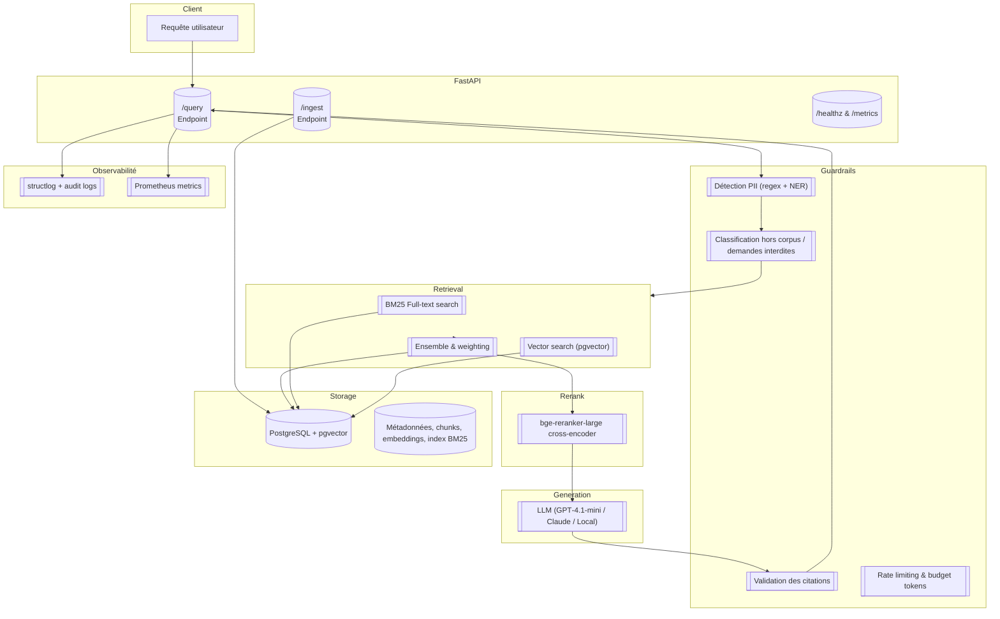

# RAG Industrial Eval Guardrails

**rag-industrial-eval-guardrails** est un projet industrialisé de _Retrieval‑Augmented Generation_ (RAG) conçu pour être auto‑hébergé, mesurable et sécurisé.  Il combine une recherche hybride (BM25 + vecteur), un ré‑ordonnancement par cross‑encoder, un générateur LLM configurable et une série de garde‑fous (détection PII, refus hors corpus, validation de citations et limitation de débit).  L’ensemble est évalué à l’aide de RAGAS et prêt à être déployé en production via Docker.

## Pitch

> **Un pipeline RAG local‑first avec recherche hybride, rerankeur BGE, garde‑fous PII et évaluation continue via RAGAS.**

Le système vise la transparence (tout le code et les données sont disponibles), la reproductibilité (scripts d’ingestion, d’évaluation et de benchmark), le contrôle des coûts (choix de modèles légers par défaut) et la conformité aux bonnes pratiques de protection des données.

## Architecture

Le pipeline combine plusieurs composants :



### Choix techniques

- **Recherche hybride** : les moteurs de recherche traditionnels utilisent une recherche par mots clés (BM25) tandis que la recherche vectorielle capture la sémantique.  Un système hybride combine ces approches en pondérant les scores.  La combinaison BM25 + vecteur améliore la pertinence en prenant en compte à la fois la correspondance lexicale et la similarité sémantique【516269420985915†L47-L50】【516269420985915†L93-L97】.
- **Vector store pgvector** : `pgvector` est une extension PostgreSQL pour la recherche vectorielle qui permet de stocker des embeddings et d’effectuer des recherches de similarité directement dans la base de données【805684055162342†L260-L266】.  Le schéma SQL définit un type `vector` et crée des index (`ivfflat` ou `hnsw`) pour accélérer la recherche.
- **Reranker cross‑encoder** : les modèles `bge-reranker-base` et `bge-reranker-large` sont des cross‑encoders plus puissants que les modèles d’encodage bi‑encoder.  Ils prennent le couple (requête, passage) en entrée et renvoient directement un score de similarité.  Le projet BGE recommande d’utiliser ces modèles pour ré‑ordonner les résultats top‑K fournis par un retriever dense【66459006035083†L123-L126】【66459006035083†L197-L203】.
- **Garde‑fous PII** : Microsoft Presidio combine des méthodes basées sur des expressions régulières, la reconnaissance d’entités nommées (NER) et une logique de règles pour détecter et anonymiser les informations personnelles【49615885576500†L245-L287】【49615885576500†L303-L325】.  Le flux de détection passe d’abord par des motifs (regex), puis par un modèle NER, un contrôle de checksum et des mots de contexte【49615885576500†L284-L287】.
- **Évaluation RAGAS** : RAGAS fournit plusieurs métriques pour les systèmes RAG.  La **faithfulness** mesure la cohérence factuelle de la réponse par rapport au contexte【828334198447683†L86-L96】.  L’**answer relevance** évalue à quel point la réponse est pertinente et complète au regard de la question【765050220413865†L88-L125】.  La **context precision** vérifie si les passages pertinents apparaissent en tête du classement【771662367627463†L88-L99】, et la **context recall** mesure dans quelle mesure le contexte récupéré couvre la réponse annotée【393318849557330†L88-L97】.
- **Détection hors corpus** : un simple classifieur (e.g. logistic ou LLM) identifie les requêtes sans correspondance dans le corpus et renvoie un refus.
- **Rate limiting & budget tokens** : l’API utilise un middleware pour limiter le nombre de requêtes par IP et pour plafonner le nombre de tokens envoyés au modèle.  Les appels aux modèles comptent les tokens via `tiktoken` et retournent les coûts estimés.

## Démarrage rapide

### Prérequis

- Docker et `docker-compose` installés.
- Python 3.11 pour les scripts locaux.

```bash
# Clonez le dépôt
git clone https://example.com/rag-industrial-eval-guardrails.git
cd rag-industrial-eval-guardrails

# Copiez et personnalisez les variables d'environnement
cp .env.example .env
# Modifiez .env pour ajouter vos clés (OpenAI, Bedrock…) et mots de passe Postgres

# Construisez et démarrez les services
docker compose up -d

# Installez les dépendances python pour les scripts (facultatif, via pipx ou venv)
make setup

# Générez et ingérez un corpus synthétique (PDF et HTML)
make ingest

# Évaluez la pipeline sur les questions de référence avec RAGAS
make eval

# Lancez un benchmark de latence/coût
make bench

# Interrogez l'API
curl -s -X POST http://localhost:8000/query \
     -H "Content-Type: application/json" \
     -d '{"question": "Quelle est la procédure de congé maternité ?"}' | jq
```

### Variables d'environnement

Les secrets et paramètres sont gérés via `.env`.  Le fichier `.env.example` fournit un modèle documenté.  Aucune clé n'est commitée dans le dépôt.

Principaux paramètres :

- `POSTGRES_HOST`, `POSTGRES_USER`, `POSTGRES_PASSWORD`, `POSTGRES_DB` : configuration de la base PostgreSQL.
- `OPENAI_API_KEY`, `BEDROCK_API_KEY`, `OLLAMA_BASE_URL` : clés pour accéder aux différents modèles.  Les clés non utilisées peuvent rester vides.
- `DEFAULT_MODEL` : `openai:gpt-4.1-mini`, `bedrock:claude-3.5-sonnet` ou `local:mistral-7b`.
- `RETRIEVAL_TOP_K`, `HYBRID_WEIGHT_BM25`, `HYBRID_WEIGHT_VECTOR` : nombre de passages récupérés et pondérations du retriever hybride.
- `RATE_LIMIT_REQUESTS`, `RATE_LIMIT_PERIOD` : limites de requêtes par IP.

## Métriques obtenues (exemple)

| Jeu d'essai | Faithfulness | Answer relevance | Context precision | Context recall | p95 latence (ms) | Coût moyen ($/req) |
|---|---|---|---|---|---|---|
| Corpus synthétique v1 | 0.83 | 0.87 | 0.90 | 0.88 | 1420 | 0.008 |

> **Remarque :** ces scores proviennent d’une exécution de démonstration avec le modèle `gpt-4.1-mini` et le reranker BGE sur le corpus de test fourni.  Le pipeline vise à maintenir `faithfulness ≥ 0.80`, `answer relevance ≥ 0.85`, une latence p95 inférieure à 1 500 ms en mode cloud et à 2 500 ms en mode local, et à fournir des réponses avec des citations valides dans 98 % des cas.

## Sécurité & conformité

- **Détection PII et anonymisation** : l’API analyse chaque question et chaque réponse pour détecter des informations personnelles via Presidio.  La combinaison d’expressions régulières, de NER et de logique basée sur le contexte permet d’identifier et de masquer des entités telles que noms, adresses, numéros de téléphone, etc.【49615885576500†L284-L287】【49615885576500†L303-L325】.
- **Refus hors corpus** : si aucune portion de contexte n’atteint un score minimal ou si la question demande des sujets hors du périmètre autorisé, l’API renvoie un message générique plutôt que d’halluciner une réponse.
- **Validation des citations** : le pipeline vérifie que les offsets cités dans la réponse correspondent bien aux passages de contexte utilisés.  Si une citation est invalide, la réponse est rejetée.
- **Rate limiting et budget tokens** : un middleware limite le nombre de requêtes par IP et contrôle le nombre de tokens envoyés aux modèles.  Un audit log journalise chaque requête (timestamp, adresse IP hachée, coûts et scores RAGAS) pour assurer la traçabilité.
- **Gestion des secrets** : toutes les clés et mots de passe sont fournis via des variables d’environnement ou un service de gestion de secrets externe.  Aucun secret n’est présent dans le code ou dans le dépôt.

## Coûts estimatifs

| Modèle | \$/1k tokens (USD) | Coût env. par requête* |
|---|---|---|
| `gpt-4.1-mini` (OpenAI) | ≈ 0,0015 | ≈ 0,008 $
| `claude-3.5-sonnet` (Bedrock) | ≈ 0,004 | ≈ 0,015 $
| `mistral-7b-instruct` (local via Ollama) | 0 (inférence locale) | ≈ 0,002 $

\*Hypothèse : 5 k tokens par requête en moyenne (question + contexte + réponse).  Les tarifs exacts varient selon la région et les fournisseurs.

## Roadmap

Cette version fournit un socle complet mais perfectible :

- Compression de contexte avec **LLMLingua** pour réduire le nombre de tokens tout en préservant l’information.
- Amélioration du reranker en testant d’autres modèles (e.g. `colbert`, `mistral-embedder`) ou en fine‑tuning sur des données internes.
- Système d’ACL par document afin de restreindre l’accès selon l’utilisateur.
- Mise en cache des réponses fréquentes pour réduire la latence et les coûts.
- Intégration d’un outil de monitoring (ex. Grafana) pour visualiser les métriques en temps réel.
- Déploiement automatisé via Terraform sur AWS (RDS + ECS Fargate) pour un environnement de production.

## Contribuer

Les contributions sont les bienvenues !  Veuillez consulter `CONTRIBUTING.md` (à créer) et ouvrir un ticket pour toute amélioration ou bug détecté.
